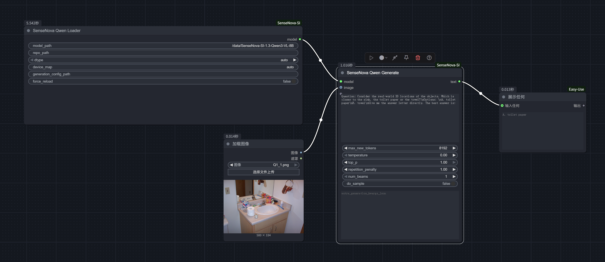
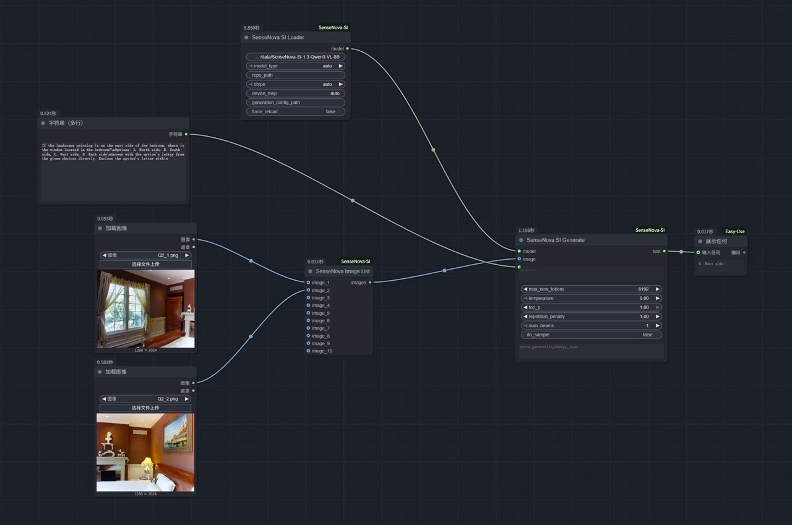

# ComfyUI-SenseNova-SI

ComfyUI custom node wrapper for [SenseNova-SI](https://github.com/OpenSenseNova/SenseNova-SI) VLM inference.

## Features

- Loads SenseNova-SI Qwen and InternVL models from a local source checkout.
- Caches loaded model handles so repeated ComfyUI runs do not rebuild the model unless requested.
- Accepts batched ComfyUI `IMAGE` tensors and converts them to the format expected by each model type.
- Provides an image-list helper node for multi-image prompts.

## Layout

```text
ComfyUI/custom_nodes/ComfyUI-SenseNova-SI/
  __init__.py
  nodes.py
  utils.py
  docs/
    single.png
    multi.png
  example_workflows/
    sensenova-si.json
  deps/
    SenseNova-SI/
```

This custom node expects a source checkout of [SenseNova-SI](https://github.com/OpenSenseNova/SenseNova-SI). By default it looks for:

1. `repo_path` from the loader node
2. `SENSENOVA_SI_REPO` environment variable
3. `deps/SenseNova-SI/`
4. The parent directory of this custom node, which makes local development inside the upstream repo work

## Requirements

- Python 3.10 or newer.
- A working ComfyUI installation.
- A local checkout of [SenseNova-SI](https://github.com/OpenSenseNova/SenseNova-SI).
- A GPU environment that can run the selected SenseNova-SI model.

## Install

1. Clone ComfyUI:

   ```bash
   git clone https://github.com/comfyanonymous/ComfyUI.git
   cd ComfyUI
   ```

2. Clone this custom node:

   ```bash
   cd custom_nodes
   git clone https://github.com/GACLove/ComfyUI-SenseNova-SI.git
   ```

3. Clone or link [SenseNova-SI](https://github.com/OpenSenseNova/SenseNova-SI) into `deps/`:

   ```bash
   cd ComfyUI-SenseNova-SI
   git clone https://github.com/OpenSenseNova/SenseNova-SI.git deps/SenseNova-SI
   ```

4. Install dependencies:

   ```bash
   pip install -r requirements.txt
   ```

5. Install the upstream SenseNova-SI dependencies required by the model you plan to run. Follow the upstream README for model-specific setup and checkpoints.

6. Start ComfyUI:

   ```bash
   cd ../../..  # back to ComfyUI root
   python main.py --listen 0.0.0.0 --port 8000 --cuda-device 0
   ```

## Example Workflow

An example workflow is available at [`example_workflows/sensenova-si.json`](example_workflows/sensenova-si.json).

To use it, copy or import the workflow in ComfyUI, update the loader node's `model_path` and `repo_path` if needed, and connect your input image nodes.

Single-image workflow:



Multi-image workflow:



## Nodes

### SenseNova SI Loader

Loads a SenseNova-SI model once and caches it by:

- repo path
- model path
- dtype
- device map
- generation config path

Use `force_reload` when you need to rebuild the model object.

Inputs:

| Input | Description |
| --- | --- |
| `model_path` | Local path or Hugging Face model ID passed to the upstream SenseNova-SI model class. |
| `model_type` | `auto`, `qwen`, or `internvl`. Auto-detection uses the model path. |
| `repo_path` | Optional local path to the SenseNova-SI source checkout. |
| `dtype` | Qwen dtype option: `auto`, `bfloat16`, `float16`, or `float32`. |
| `device_map` | Qwen device map passed through to the upstream loader. |
| `generation_config_path` | Optional absolute path or path relative to the SenseNova-SI repo root. |
| `force_reload` | Rebuilds the cached model handle when enabled. |

### SenseNova SI Generate

Runs repeated inference against the loaded model handle.

- `IMAGE` inputs are converted from ComfyUI tensors `[B, H, W, C]` into `PIL.Image`
- if the prompt does not contain `<image>`, the node prepends one token per image
- if the prompt already contains `<image>`, the count must match the image batch size
- `extra_generation_kwargs_json` overrides the exposed generation settings

### SenseNova Image List

Aggregates up to 10 individual ComfyUI `IMAGE` inputs into one batched `IMAGE` output. Use this when a prompt should reference multiple images.

## Notes

- Supports Qwen and InternVL model types (auto-detected from model path).
- The upstream [SenseNova-SI](https://github.com/OpenSenseNova/SenseNova-SI) repo is used as source, not installed as a Python package.
- InternVL generation receives temporary image files because the upstream InternVL wrapper expects file paths.
- This repository is MIT licensed. Check upstream SenseNova-SI model, code, and checkpoint licenses before redistributing models or generated artifacts.

## Development

Run the same checks used by CI:

```bash
ruff check .
ruff format --check .
```

Format local changes with:

```bash
ruff format .
```

## License

This project is licensed under the [MIT License](LICENSE).
